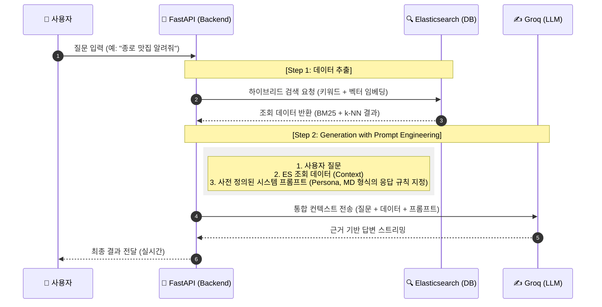

# 🍽️ AI 서울시내 맛집 검색 어시스턴트 (FastAPI + Groq + Elasticsearch)

본 프로젝트는 사용자의 의도를 분석하여 최적의 맛집을 추천하는 **RAG(Retrieval-Augmented Generation)** 기반 백엔드 시스템입니다. 
단순 LLM 호출을 넘어, 데이터의 정확도와 서비스 속도를 높이기 위한 아키텍처 개선 과정을 거쳐 완성되었습니다.

---

## 🏗️ 시스템 시퀀스 구조도 (System Flow)

사용자 질문이 답변으로 반환되기까지의 논리적 흐름입니다.

## 💡 기술 스택 전환 및 개선 히스토리 (Migration History)

이 프로젝트는 개발 과정에서 직면한 성능적 한계를 기술적으로 분석하고 해결하며 고도화되었습니다.

### 1. 검색 엔진: ChromaDB ➔ Elasticsearch 8.1 (정확도 개선)
* **문제점 (Pain Point):** 초기에는 가벼운 ChromaDB를 사용했으나, 단순 벡터 유사도 기반 검색만으로는 식당 이름이나 특정 메뉴명, 주소 같은 **정확한 키워드 매칭**에서 검색 정확도가 현저히 떨어지는 현상이 발생했습니다.
* **해결책 (Solution):** **Elasticsearch 8버전** 부터는 **임베딩 검색**도 지원이 가능하여 es8버전으로 전환하여 텍스트 기반의 **BM25 알고리즘**과 고도화된 **벡터 임베딩 기반의 k-NN 검색**을 결합한 **하이브리드 검색**을 구현했습니다.
* **결과:** 사용자의 추상적인 의도와 구체적인 정보를 동시에 파악하여, 이전보다 정교한 데이터 추출이 가능해졌습니다. 현재도 원하는 정도까지는 검색 정확도가 나오지 않아 개선중입니다.

---

### 2. 추론 인프라: Local Llama ➔ Groq LPU (속도 개선)
* **문제점 (Pain Point):** 개인 PC 사양(로컬 환경)에서 Llama 모델을 직접 구동했을 때, 모델의 크기(Parameter) 대비 연산 자원의 한계로 **토큰 생성 속도가 지나치게 느려** 실제 서비스가 불가능했습니다. (간단한 질문에도 30초이상 소요)
* **해결책 (Solution):**  **Groq API**를 사용하도록 전환했습니다.
* **결과:** 70B 규모의 거대 모델에서도 지연(Latency) 없이 **초당 수백 토큰의 실시간 스트리밍 응답** 환경을 구축하여 사용자 경험을 극대화했습니다.
* **보안상 문제** : Groq API 호출 시 전송되는 질문 내용과 검색 데이터는 외부 서버로 전달됩니다. 따라서 데이터 보안 유지가 필요한경우 사용에 적합하지 않습니다.
  
 
---

## 🔐 보안 및 환경 설정 (Security)
### API Key 관리
* **보안 강화:** Groq API 키와 같은 민감 정보는 소스 코드에 직접 노출하지 않고, **`.env`** 파일에 격리하여 관리합니다.

---

### 샘플 데이터
[공공 데이터 포털](https://www.data.go.kr/index.do)에서 데이터를 참조했습니다.

